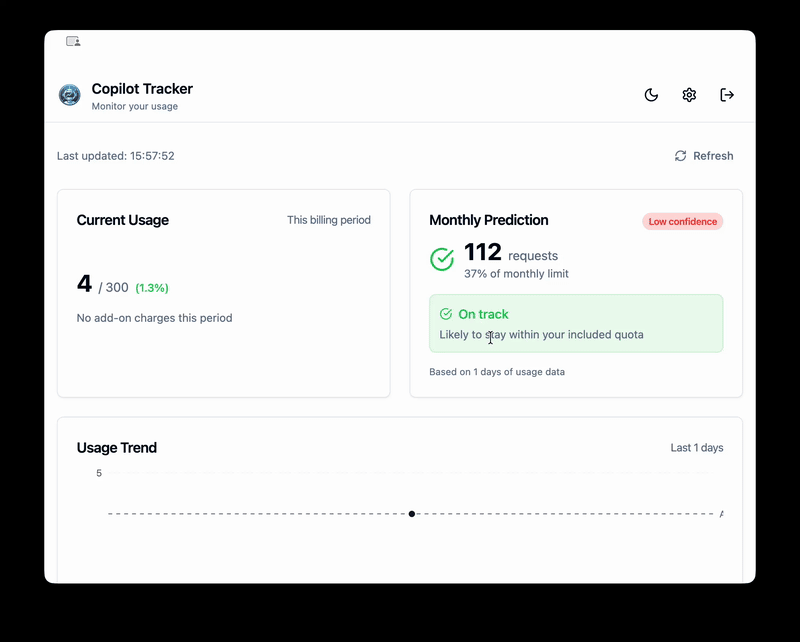
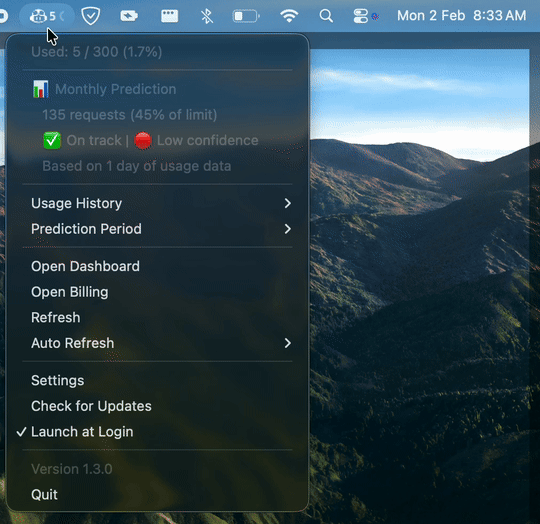

#  Copilot Tracker

> A modern, cross-platform GitHub Copilot usage monitoring application

[](https://opensource.org/licenses/MIT)
[](https://github.com/bizzkoot/copilot-tracker)

Cross-platform desktop application built with Electron, React, and TypeScript to monitor your GitHub Copilot usage, featuring system tray integration, usage predictions, and smart notifications.

## Features

- 🖥️ **Cross-Platform**: Works on macOS, Windows, and Linux
- 📊 **Usage Tracking**: Real-time monitoring of Copilot premium requests
- 📈 **Trend Visualization**: Beautiful charts showing usage patterns over time
- 🔮 **Smart Predictions**: AI-powered end-of-month usage predictions
- 🌓 **Dark/Light Theme**: Automatic theme detection with manual override
- 🔔 **Smart Notifications**: Configurable alerts when approaching limits
- 🎯 **System Tray**: Quick access from menu bar (macOS) or system tray
- 🔐 **Secure Auth**: WebView-based GitHub OAuth (no API tokens stored)
- 🔄 **Auto-Updates**: Automatic updates via GitHub releases
- 📡 **Offline Mode**: View cached usage data even without internet

## Screenshots

### Dashboard

<p align="center">
  
</p>

### System Tray (Windows)

<p align="center">
  
</p>

## Download

Choose the file that matches your operating system from the [latest release](https://github.com/bizzkoot/copilot-tracker/releases/latest):

| Operating System                  | Download This File                |
| --------------------------------- | --------------------------------- |
| **macOS** (Intel & Apple Silicon) | `copilot-tracker-X.X.X.dmg`       |
| **Windows**                       | `Copilot-Tracker-Setup-X.X.X.exe` |
| **Linux** (any distribution)      | `copilot-tracker-X.X.X.AppImage`  |
| **Linux** (Debian/Ubuntu only)    | `copilot-tracker-X.X.X.deb`       |

> **Note:** Replace `X.X.X` with the latest version number from the releases page.

<details>
<summary><strong>🔒 Privacy & Security</strong></summary>

### How it works

- **No API Tokens**: We do not ask for or store Personal Access Tokens (PAT).
- **Secure Auth**: Authentication happens via a secure WebView directly with GitHub.
- **Local Storage**: All data (usage history, settings) is stored locally on your machine.
- **No Tracking**: We do not collect any usage stats or analytics.

### Data Location

- **macOS**: `~/Library/Application Support/copilot-tracker/`
- **Windows**: `%APPDATA%/copilot-tracker/`
- **Linux**: `~/.config/copilot-tracker/`

</details>

<details>
<summary><strong>❓ Troubleshooting</strong></summary>

### Common Issues

**Data not updating?**

- Try re-logging in via the Settings menu.
- Check your internet connection.
- GitHub's internal API might have changed. Check for app updates.

**"Unrecognized App" Warning?**

- See the **Security Warnings** section above for bypass instructions.

### Resetting the App

If the app is stuck, you can clear data by deleting the configuration folder (see paths in Privacy section).

</details>

<details>
<summary><strong>📥 Installation Guide</strong></summary>

### macOS

```bash
# Download the .dmg from releases
open Copilot-Tracker-1.0.0.dmg
# Drag to Applications folder
```

### Windows

```bash
# Download the .exe installer from releases
Copilot-Tracker-Setup-1.0.0.exe
```

### Linux

**Option 1: AppImage (universal)**

```bash
# Download the .AppImage from releases
chmod +x copilot-tracker-1.0.0.AppImage
./copilot-tracker-1.0.0.AppImage
```

**Option 2: Debian/Ubuntu package**

```bash
# Download the .deb from releases
sudo dpkg -i copilot-tracker_1.0.0_amd64.deb
```

### Uninstallation

To remove the application and its data:

**macOS**

```bash
rm -rf /Applications/copilot-tracker.app
rm -rf ~/Library/Application\ Support/copilot-tracker
```

**Windows**

- Run the uninstaller from Control Panel or Settings.
- Delete `%APPDATA%/copilot-tracker` to remove data.

**Linux**

```bash
# If installed via AppImage, just delete the file
rm copilot-tracker-*.AppImage
rm -rf ~/.config/copilot-tracker

# If installed via deb
sudo apt remove copilot-tracker
```

</details>

<details>
<summary><strong>⚠️ Security Warnings (Unsigned Builds)</strong></summary>

⚠️ **This application is distributed without code signing.** You may see security warnings when first running the app. This is expected for open-source projects without paid developer certificates.

### macOS

When you first try to open the app, you may see:

> "App cannot be opened because it was not downloaded from the App Store"

**To bypass:**

**Option 1: Right-click method (GUI)**

1. Right-click (or Control-click) on the app
2. Select "Open"
3. Click "Open" in the confirmation dialog

**Option 2: Terminal method (remove quarantine)**

```bash
# After copying the app to Applications folder
xattr -cr /Applications/copilot-tracker.app
```

**Option 3: System Settings**

1. Open System Settings → Privacy & Security
2. Find the message about the app being blocked
3. Click "Open Anyway"

### Windows

When you first run the installer or app, you may see:

> "Microsoft Defender SmartScreen prevented an unrecognized app from starting"

**To bypass:**

1. Click "More info"
2. Click "Run anyway"

### Linux

No warnings - Linux apps run without restrictions.

### Why Unsigned?

Code signing requires paid certificates:

- **macOS**: Apple Developer Program ($99/year)
- **Windows**: Code signing certificate ($100-300/year)

As an open-source project, we distribute unsigned builds. The source code is publicly available for review if you wish to verify the app's safety.

</details>

<details>
<summary><strong>🛠️ Developer Guide</strong></summary>

## Development

### Prerequisites

- Node.js 18+ (LTS recommended)
- npm or pnpm
- Git

### Setup

```bash
# Clone the repository
git clone https://github.com/bizzkoot/copilot-tracker.git
cd copilot-tracker

# Install dependencies
npm install

# Start development server
npm run dev
```

### Build

```bash
# Build for current platform
npm run build

# Build for specific platforms
npm run build:mac      # macOS
npm run build:win      # Windows
npm run build:linux    # Linux
```

## Building for Production

### Prerequisites

For Linux builds, install canvas dependencies:

```bash
sudo apt-get install build-essential libcairo2-dev libpango1.0-dev \
  libjpeg-dev libgif-dev librsvg2-dev libxi-dev
```

For macOS builds, install:

```bash
brew install cairo pango libjpeg giflib librsvg
```

### Build Commands

```bash
# Build for current platform (unsigned)
npm run build

# Build for specific platforms
npm run build:mac      # macOS DMG
npm run build:win      # Windows installer
npm run build:linux    # Linux AppImage, snap, deb

# Build without packaging (for testing)
npm run build:unpack
```

### Environment Variables

Copy `.env.example` to `.env` and configure:

```bash
cp .env.example .env
```

Available variables:

- `APP_ID` - Application identifier
- `PRODUCT_NAME` - Product name
- `GITHUB_BILLING_URL` - GitHub billing page URL
- `GITHUB_LOGIN_URL` - GitHub login page URL
- `COST_PER_REQUEST` - Cost per Copilot request (default: 0.04)

</details>

<details>
<summary><strong>ℹ️ Project Details & Contributing</strong></summary>

## Tech Stack

| Component | Technology               |
| --------- | ------------------------ |
| Framework | Electron 33+             |
| Frontend  | React 18                 |
| Language  | TypeScript               |
| Styling   | Tailwind CSS + shadcn/ui |
| State     | Zustand                  |
| Charts    | Recharts                 |
| Build     | electron-vite            |
| Packaging | electron-builder         |

## Project Status

✅ **Status**: v1.0.0 Completed

## Roadmap

- [x] Complete project planning and research
- [x] Phase 1: Project setup and scaffolding
- [x] Phase 2: Core data types and services
- [x] Phase 3: Authentication system
- [x] Phase 4: Data fetching and caching
- [x] Phase 5: Dashboard UI
- [x] Phase 6: System tray integration
- [x] Phase 7: Settings and preferences
- [x] Phase 8: Notifications
- [x] Phase 9: Packaging and distribution
- [x] v1.0.0 Release

## Contributing

Contributions are welcome! Please feel free to submit a Pull Request.

### Development Workflow

1.  **Fork & Clone**: Fork the repo and clone it locally.
2.  **Branch**: Create your feature branch (`git checkout -b feature/AmazingFeature`).
3.  **Code**: Implement your changes.
    - Follow the code style (PascalCase for components, camelCase for functions).
    - Use `npm run lint` to check for issues.
    - Use `npm run format` to ensure consistent formatting.
4.  **Commit**: Commit your changes (`git commit -m 'Add some AmazingFeature'`).
5.  **Push**: Push to the branch (`git push origin feature/AmazingFeature`).
6.  **PR**: Open a Pull Request.

</details>

## License

This project is licensed under the MIT License - see the [LICENSE](LICENSE) file for details.

## Acknowledgments

- Inspired by [opencode-bar](https://github.com/kargnas/opencode-bar) by kargnas
  - `Previously known as copilot-usage-monitor (by hyp3rflow)`
- UI components from [shadcn/ui](https://ui.shadcn.com/)
- Built with [Electron](https://www.electronjs.org/)

## Support

- 🐛 [Report a bug](https://github.com/bizzkoot/copilot-tracker/issues)
- 💡 [Request a feature](https://github.com/bizzkoot/copilot-tracker/issues)

---

**Note**: This application is not officially affiliated with GitHub or Microsoft. It uses GitHub's internal billing APIs which may change without notice.
