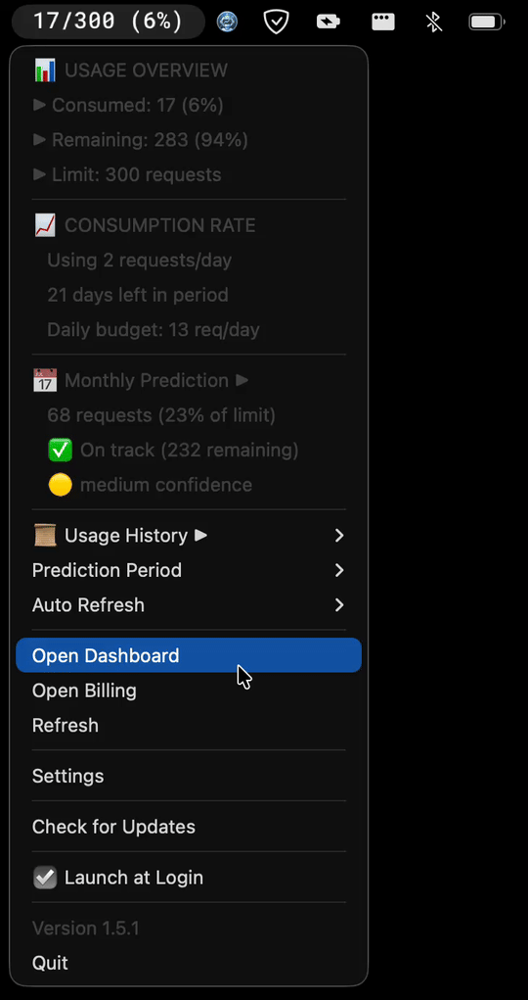

#  Copilot Tracker

> A modern, cross-platform GitHub Copilot usage monitoring application

[](https://opensource.org/licenses/MIT)
[](https://github.com/bizzkoot/copilot-tracker)

Cross-platform desktop application built with **Tauri**, React, and TypeScript to monitor your GitHub Copilot usage, featuring system tray integration, usage predictions, and smart notifications.

## Features

- 🖥️ **Cross-Platform**: Works on macOS, Windows, and Linux
- 📊 **Usage Tracking**: Real-time monitoring of Copilot premium requests
- 📈 **Trend Visualization**: Beautiful charts showing usage patterns over time
- 🔮 **Smart Predictions**: AI-powered end-of-month usage predictions
- 🌓 **Dark/Light Theme**: Automatic theme detection with manual override
- 🔔 **Smart Notifications**: Configurable alerts when approaching limits
- 🎯 **System Tray**: Quick access from menu bar (macOS) or system tray
- 🎨 **Customizable Tray Icon**: Choose from 7 display formats (current, remaining, percentage, etc.)
- 🔐 **Secure Auth**: WebView-based GitHub OAuth (no API tokens stored)
- 🔄 **Auto-Updates**: Automatic updates via GitHub releases
- 📡 **Offline Mode**: View cached usage data even without internet

## Screenshots

### Dashboard

<p align="center">
  
</p>

### System Tray (Windows)

<p align="center">
  
</p>

## Download

Choose the file that matches your operating system from the [latest release](https://github.com/bizzkoot/copilot-tracker/releases/latest):

### Tauri Builds (Recommended - v1.4.2+)

**Modern, lightweight builds with better performance and smaller file sizes**

| Operating System                  | Download This File                                 |
| --------------------------------- | -------------------------------------------------- |
| **macOS** (Intel & Apple Silicon) | `Copilot.Tracker_X.X.X_universal.dmg` (Tauri)      |
| **Windows** (64-bit)              | `Copilot.Tracker_X.X.X_x64-setup.exe` (Tauri NSIS) |
| **Windows** (MSI installer)       | `Copilot.Tracker_X.X.X_x64_en-US.msi` (Tauri)      |
| **Linux** (any distribution)      | `Copilot.Tracker_X.X.X_amd64.AppImage` (Tauri)     |
| **Linux** (Debian/Ubuntu)         | `Copilot.Tracker_X.X.X_amd64.deb` (Tauri)          |

### Electron Builds (Discontinued)

**⚠️ Electron builds stopped at v1.5.1. Only Tauri builds are released from v1.5.2 onward.**

> **Note:**
>
> - **Tauri builds** are the only supported platform going forward (smaller, faster, more secure).
> - Electron builds for macOS, Windows, and Linux were discontinued after v1.5.1.
> - No new Electron releases will be published.

<details>
<summary><strong>🔒 Privacy & Security</strong></summary>

### How it works

- **No API Tokens**: We do not ask for or store Personal Access Tokens (PAT).
- **Secure Auth**: Authentication happens via a secure WebView directly with GitHub.
- **Local Storage**: All data (usage history, settings) is stored locally on your machine.
- **No Tracking**: We do not collect any usage stats or analytics.

### Data Location

- **macOS**: `~/Library/Application Support/copilot-tracker/`
- **Windows**: `%APPDATA%/copilot-tracker/`
- **Linux**: `~/.config/copilot-tracker/`

</details>

<details>
<summary><strong>❓ Troubleshooting</strong></summary>

### Common Issues

**Data not updating?**

- Try re-logging in via the Settings menu.
- Check your internet connection.
- GitHub's internal API might have changed. Check for app updates.

**"Unrecognized App" Warning?**

- See the **Security Warnings** section above for bypass instructions.

### Resetting the App

If the app is stuck, you can clear data by deleting the configuration folder (see paths in Privacy section).

</details>

<details>
<summary><strong>📥 Installation Guide</strong></summary>

### Tauri Builds (v1.4.2+)

#### macOS

```bash
# Download the Tauri .dmg from releases
open Copilot.Tracker_1.4.2_universal.dmg
# Drag to Applications folder
```

**Remove quarantine (if you see security warnings):**

```bash
# For Tauri build
xattr -cr /Applications/"Copilot Tracker.app"
```

#### Windows

```bash
# Option 1: NSIS Installer (recommended)
Copilot.Tracker_1.4.2_x64-setup.exe

# Option 2: MSI Installer
Copilot.Tracker_1.4.2_x64_en-US.msi
```

**Note:** No CMD window will appear when running the Tauri build.

#### Linux

**Option 1: AppImage (universal)**

```bash
# Download the Tauri .AppImage from releases
chmod +x Copilot.Tracker_1.4.2_amd64.AppImage
./Copilot.Tracker_1.4.2_amd64.AppImage
```

**Option 2: Debian/Ubuntu package**

```bash
# Download the Tauri .deb from releases
sudo dpkg -i Copilot.Tracker_1.4.2_amd64.deb
```

### Uninstallation

To remove the application and its data:

**macOS**

```bash
rm -rf /Applications/"Copilot Tracker.app"
rm -rf ~/Library/Application\ Support/copilot-tracker
```

**Windows**

- Run the uninstaller from Control Panel or Settings.
- Delete `%APPDATA%/copilot-tracker` to remove data.

**Linux**

```bash
# If installed via AppImage, just delete the file
rm Copilot.Tracker_*.AppImage
rm -rf ~/.config/copilot-tracker

# If installed via deb
sudo apt remove copilot-tracker
```

</details>

<details>
<summary><strong>⚠️ Security Warnings (Unsigned Builds)</strong></summary>

⚠️ **This application is distributed without code signing.** You may see security warnings when first running the app. This is expected for open-source projects without paid developer certificates.

### macOS

When you first try to open the app, you may see:

> "App cannot be opened because it was not downloaded from the App Store"

**To bypass:**

**Option 1: Right-click method**

1. Right-click (or Control-click) the app in Applications folder
2. Click "Open"
3. Click "Open" again in the dialog

**Option 2: Terminal method (remove quarantine)**

```bash
xattr -cr /Applications/"Copilot Tracker.app"
```

### Windows

When you first run the installer or app, you may see:

> "Microsoft Defender SmartScreen prevented an unrecognized app from starting"

**To bypass:**

1. Click "More info"
2. Click "Run anyway"

### Linux

No warnings - Linux apps run without restrictions.

### Why Unsigned?

Code signing requires paid certificates:

- **macOS**: Apple Developer Program ($99/year)
- **Windows**: Code signing certificate ($100-300/year)

As an open-source project, we distribute unsigned builds. The source code is publicly available for review if you wish to verify the app's safety.

</details>

<details>
<summary><strong>🛠️ Developer Guide</strong></summary>

## Development

### Prerequisites

- Node.js 18+ (LTS recommended)
- npm or pnpm
- Git
- **For Tauri development:**
  - Rust (latest stable)
  - System dependencies (see below)

### Setup

```bash
# Clone the repository
git clone https://github.com/bizzkoot/copilot-tracker.git
cd copilot-tracker

# Install dependencies
npm install

# Start Tauri development server
npm run tauri:dev
```

### Build

```bash
# Tauri builds (all platforms)
npm run tauri:build:mac     # macOS (universal binary)
npm run tauri:build:win     # Windows
npm run tauri:build:linux   # Linux
```

## Building for Production

### System Dependencies

**For Tauri Linux builds:**

```bash
sudo apt-get install -y \
  libwebkit2gtk-4.1-dev \
  build-essential \
  curl \
  wget \
  file \
  libssl-dev \
  libayatana-appindicator3-dev \
  librsvg2-dev
```

**For Tauri macOS builds:**

```bash
# Rust targets for universal binary
rustup target add aarch64-apple-darwin x86_64-apple-darwin
```

### Build Commands

```bash
# Tauri builds
npm run tauri:build           # Current platform
npm run tauri:build:mac       # macOS universal binary
npm run tauri:build:win       # Windows (x64)
npm run tauri:build:linux     # Linux (x64)

# Lint and format
npm run lint                  # Check code style
npm run format                # Auto-format code
npm run typecheck             # TypeScript type checking
```

### Environment Variables

Copy `.env.example` to `.env` and configure:

```bash
cp .env.example .env
```

Available variables:

- `APP_ID` - Application identifier
- `PRODUCT_NAME` - Product name
- `GITHUB_BILLING_URL` - GitHub billing page URL
- `GITHUB_LOGIN_URL` - GitHub login page URL
- `COST_PER_REQUEST` - Cost per Copilot request (default: 0.04)

</details>

<details>
<summary><strong>ℹ️ Project Details & Contributing</strong></summary>

## Tech Stack

| Component | Technology                       |
| --------- | -------------------------------- |
| Framework | Tauri 2.0                        |
| Frontend  | React 18                         |
| Language  | TypeScript, Rust (Tauri backend) |
| Styling   | Tailwind CSS + shadcn/ui         |
| State     | Zustand                          |
| Charts    | Recharts                         |
| Build     | Vite                             |
| Packaging | Tauri CLI                        |

## Project Status

✅ **Status**: v1.5.1 - Tauri Only

## Version History

- **v1.5.1** (Latest) - Tauri only, Electron builds discontinued
- **v1.5.0** - Added customizable tray icon formats
- **v1.4.2** - Tauri build for all platforms, Electron macOS only
- **v1.4.1** - Last version with Electron Windows/Linux support
- **v1.0.0** - Initial release (Electron-only)

> **Breaking Change:** Electron builds stopped at v1.5.1. Only Tauri builds are released from v1.5.2 onward.

## Platform Support

| Platform              | Tauri |
| --------------------- | :---: |
| macOS (Intel)         |  ✅   |
| macOS (Apple Silicon) |  ✅   |
| Windows 64-bit        |  ✅   |
| Linux (x64)           |  ✅   |

> **Note:** Electron builds were discontinued after v1.5.1. All releases from v1.5.2 onward are Tauri-only.

## Roadmap

- [x] Complete project planning and research
- [x] Phase 1: Project setup and scaffolding
- [x] Phase 2: Core data types and services
- [x] Phase 3: Authentication system
- [x] Phase 4: Data fetching and caching
- [x] Phase 5: Dashboard UI
- [x] Phase 6: System tray integration
- [x] Phase 7: Settings and preferences
- [x] Phase 8: Notifications
- [x] Phase 9: Packaging and distribution
- [x] v1.0.0 Release (Electron)
- [x] v1.4.2 - Tauri migration
- [ ] Multi-account support

## Contributing

Contributions are welcome! Please feel free to submit a Pull Request.

### Development Workflow

1.  **Fork & Clone**: Fork the repo and clone it locally.
2.  **Branch**: Create your feature branch (`git checkout -b feature/AmazingFeature`).
3.  **Code**: Implement your changes.
    - Follow the code style (PascalCase for components, camelCase for functions).
    - Use `npm run lint` to check for issues.
    - Use `npm run format` to ensure consistent formatting.
4.  **Commit**: Commit your changes (`git commit -m 'Add some AmazingFeature'`).
5.  **Push**: Push to the branch (`git push origin feature/AmazingFeature`).
6.  **PR**: Open a Pull Request.

</details>

## License

This project is licensed under the MIT License - see the [LICENSE](LICENSE) file for details.

## Acknowledgments

- Inspired by [opencode-bar](https://github.com/kargnas/opencode-bar) by kargnas
  - `Previously known as copilot-usage-monitor`
- UI components from [shadcn/ui](https://ui.shadcn.com/)
- Built with [Tauri](https://tauri.app/)

## Support

- 🐛 [Report a bug](https://github.com/bizzkoot/copilot-tracker/issues)
- 💡 [Request a feature](https://github.com/bizzkoot/copilot-tracker/issues)

---

**Note**: This application is not officially affiliated with GitHub or Microsoft. It uses GitHub's internal billing APIs which may change without notice.
