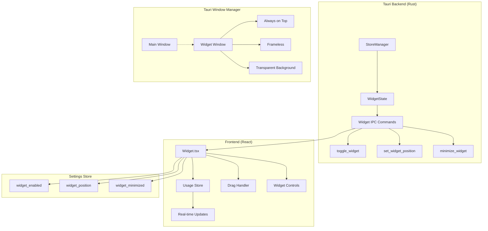
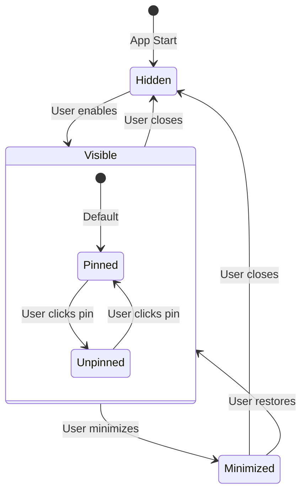

# Floating Usage Widget Design

**Date:** 2026-02-09  
**Status:** Design Phase  
**Priority:** High

## Summary

Design and implement a floating, draggable usage widget that provides persistent visibility of GitHub Copilot quota usage. The widget solves the Windows tray icon visibility problem by providing an always-on-top, compact display that shows real-time usage data.

## Problem Statement

**Current Issue:**
- Custom tray icon with quota data is not easily viewable in Windows
- When pinning to taskbar, Windows shows the Tauri app icon, not the custom tray icon
- Users need to hover/click tray icon to see usage data

**Solution:**
A floating usage widget that:
- Is always visible on screen (user-controlled)
- Shows real-time usage data at a glance
- Can be dragged to any position
- Can be minimized/hidden when not needed

## Architecture Overview



## Widget UI Design

### Layout Structure

```
┌─────────────────────────────────────┐
│  [≡]  Copilot Usage  [📌][−][×]    │
├─────────────────────────────────────┤
│  ████████████░░░░  75%              │
│  750 / 1,000 requests               │
│                                     │
│  📊 Predicted: 1,200 (may exceed)   │
│  🟢 Based on 7 days of data         │
└─────────────────────────────────────┘

Legend:
[≡]  - Drag handle (click & hold to move)
[📌] - Anchor/Pin toggle (pinned = always on top, unpinned = desktop only)
[−]  - Minimize to tray
[×]  - Close widget
```

### Color Coding

| Usage Range | Color | Meaning |
|-------------|-------|---------|
| 0-50% | Green | ✅ On track |
| 51-80% | Yellow | ⚠️ Monitor |
| 81-100% | Orange | 🔴 Near limit |
| >100% | Red | 🚨 Exceeded |

### Widget States



### Anchor/Pin Mode Behavior

| Mode | Behavior | Use Case |
|------|----------|----------|
| **Pinned (📌)** | Widget floats above ALL windows | Working with multiple apps, need constant visibility |
| **Unpinned (📌)** | Widget stays on desktop only | Less intrusive, check usage when viewing desktop |

**Visual Indicators:**
- **Pinned**: Pin icon filled (📌) - widget has shadow/depth
- **Unpinned**: Pin icon outline (📍) - widget appears flatter

## Technical Specifications

### Window Properties

| Property | Value | Description |
|----------|-------|-------------|
| Type | Dynamic (controlled by pin state) | Pinned = alwaysOnTop, Unpinned = normal |
| Decorations | `false` | Frameless window for clean look |
| Transparent | `true` | Supports glassmorphism effect |
| Resizable | `false` | Fixed size for consistency |
| Skip Taskbar | `true` | Doesn't appear in taskbar |
| Size | 280x180 px | Compact footprint |
| Min Size | 280x180 px | Prevent accidental resizing |
| Max Size | 280x180 px | Prevent accidental resizing |

**Note:** The `alwaysOnTop` property is dynamically toggled based on the pin state.

### IPC Commands

```typescript
// Toggle widget visibility
toggle_widget(): Promise<boolean>

// Get widget position
get_widget_position(): Promise<{x: number, y: number}>

// Set widget position
set_widget_position(x: number, y: number): Promise<void>

// Minimize widget to tray
minimize_widget(): Promise<void>

// Check if widget is visible
is_widget_visible(): Promise<boolean>

// Toggle anchor/pin mode (NEW)
toggle_widget_pinned(): Promise<boolean>

// Get current pin state (NEW)
is_widget_pinned(): Promise<boolean>

// Set pin state programmatically (NEW)
set_widget_pinned(pinned: boolean): Promise<void>
```

### Settings Schema

```typescript
interface WidgetSettings {
  enabled: boolean;           // Widget enabled/disabled
  position: {
    x: number;                // X coordinate
    y: number;                // Y coordinate
  };
  minimized: boolean;         // Widget minimized state
  pinned: boolean;            // Anchor/pin mode (NEW)
  auto_hide: boolean;         // Hide when main window opens
  show_prediction: boolean;   // Show prediction data
  compact_mode: boolean;      // Show minimal info only
}
```

## Implementation Phases

### Phase 1: Tauri Configuration

**Files to modify:**
- `src-tauri/tauri.conf.json` - Add widget window config

**Changes:**
```json
{
  "app": {
    "windows": [
      {
        "label": "main",
        // ... existing config
      },
      {
        "label": "widget",
        "title": "Copilot Usage Widget",
        "width": 280,
        "height": 180,
        "minWidth": 280,
        "minHeight": 180,
        "maxWidth": 280,
        "maxHeight": 180,
        "decorations": false,
        "transparent": true,
        "alwaysOnTop": true,  // Default to pinned, can be toggled at runtime
        "skipTaskbar": true,
        "resizable": false,
        "visible": false,
        "center": false
      }
    ]
  }
}
```

### Phase 2: Backend Implementation

**Files to create:**
- `src-tauri/src/widget.rs` - Widget state management

**Files to modify:**
- `src-tauri/src/lib.rs` - Export widget module
- `src-tauri/src/main.rs` - Add widget IPC commands

### Phase 3: Frontend Implementation

**Files to create:**
- `src/renderer/src/components/widget/Widget.tsx` - Main widget component
- `src/renderer/src/components/widget/WidgetControls.tsx` - Widget controls
- `src/renderer/src/components/widget/WidgetHeader.tsx` - Draggable header with pin button
- `src/renderer/src/components/widget/PinButton.tsx` - Pin toggle button (NEW)
- `src/renderer/src/components/widget/index.ts` - Barrel export

**Files to modify:**
- `src/renderer/src/stores/settingsStore.ts` - Add widget settings
- `src/renderer/src/types/settings.ts` - Add widget types

### Phase 4: Widget Styling

**Design principles:**
- Glassmorphism effect with backdrop blur
- Compact layout with clear hierarchy
- Color-coded progress bar
- Smooth transitions and hover effects
- Works in both light and dark themes

**CSS approach:**
```css
.widget-window {
  background: rgba(30, 30, 30, 0.85);
  backdrop-filter: blur(12px);
  border: 1px solid rgba(255, 255, 255, 0.1);
  border-radius: 12px;
  box-shadow: 0 8px 32px rgba(0, 0, 0, 0.3);
}
```

## User Interactions

### Drag to Position
1. User clicks and holds on widget header
2. Widget follows mouse cursor
3. On release, position is saved to settings

### Minimize to Tray
1. User clicks minimize button (−)
2. Widget hides, tray icon shows indicator
3. Double-click tray icon to restore

### Show/Hide from Tray Menu
1. Right-click tray icon
2. Click "Show Widget" / "Hide Widget"
3. Widget toggles visibility

### Keyboard Shortcut
- `Ctrl+Shift+W` - Toggle widget visibility
- `Ctrl+Shift+P` - Toggle anchor/pin mode (NEW)

## Edge Cases

| Scenario | Behavior |
|----------|----------|
| Widget outside screen | Clamp to visible area on restore |
| Multi-monitor | Remember monitor, handle disconnect |
| DPI scaling | Adjust position on DPI change |
| App restart | Restore last position and state |
| Main window opens | Optional: auto-hide widget |

## Testing Checklist

- [ ] Widget appears when enabled from tray menu
- [ ] Widget can be dragged to any position
- [ ] Widget position persists across restarts
- [ ] Widget minimizes to tray correctly
- [ ] Widget restores from tray correctly
- [ ] Widget updates in real-time with usage data
- [ ] Color coding works correctly
- [ ] **Pin mode toggles always-on-top correctly** (NEW)
- [ ] **Unpinned widget stays on desktop only** (NEW)
- [ ] **Pin state persists across restarts** (NEW)
- [ ] Widget works on Windows 10
- [ ] Widget works on Windows 11
- [ ] Widget works with multiple monitors
- [ ] Widget respects DPI scaling
- [ ] Keyboard shortcut works (including Ctrl+Shift+P) (NEW)
- [ ] Auto-hide option works
- [ ] Widget doesn't interfere with main window

## Pin Mode Technical Details

### How Pin Mode Works

The pin mode toggles the window's `alwaysOnTop` property dynamically:

**Pinned Mode (📌):**
```typescript
// Window floats above all other windows
widget.setAlwaysOnTop(true);
```

**Unpinned Mode (📍):**
```typescript
// Window behaves like a normal window (stays on desktop)
widget.setAlwaysOnTop(false);
```

### User Experience

**Scenario 1: Working with multiple apps**
1. User enables pin mode (📌)
2. Widget floats above browser, IDE, email, etc.
3. Usage data always visible at a glance

**Scenario 2: Less intrusive mode**
1. User disables pin mode (📍)
2. Widget stays on desktop only
3. When user minimizes all apps (Win+D), widget is visible
4. When user opens any app, widget goes behind
5. Less distracting, but still accessible

### Pin Button Design

```
┌─────────────────────────────────────┐
│  [≡]  Copilot Usage  [📌][−][×]    │
│                      ↑             │
│               Pin Button            │
│                                    │
│  States:                           │
│  • Pinned:    📌 (filled icon)     │
│  • Unpinned:  📍 (outline icon)    │
│                                    │
│  Tooltip:                          │
│  • Pinned:    "Always on top"      │
│  • Unpinned:  "Desktop only"       │
└─────────────────────────────────────┘
```

## Future Enhancements

1. **Compact Mode** - Even smaller widget with minimal info
2. **Custom Themes** - User-selectable color schemes
3. **Widget Presets** - Pre-defined positions (corners, center)
4. **Multiple Widgets** - Allow multiple widgets for different data
5. **Widget Animations** - Subtle animations for data changes
6. **Click-through** - Option to make widget click-through when not dragging
7. **Auto-unpin** - Automatically unpin when main window opens (configurable)

## Dependencies

No additional dependencies required - uses existing:
- Tauri v2 window APIs
- React with Zustand for state
- Tailwind CSS for styling
- Existing usage store for data
